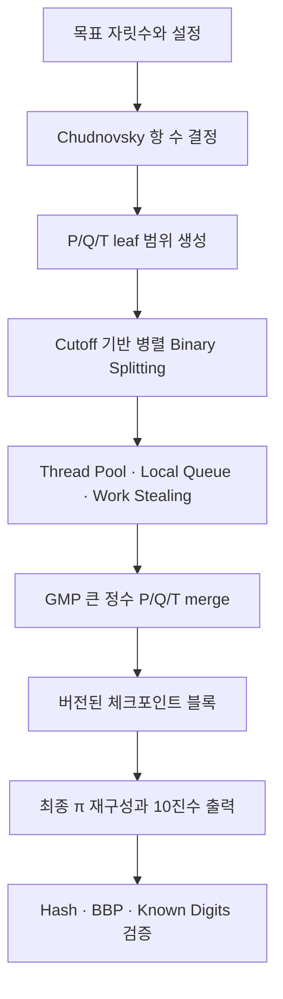

# PiEngine

PiEngine은 현대적인 C++20으로 만드는 고성능 CPU 기반 원주율 계산기입니다.

목표는 단순히 작은 자릿수의 π를 빠르게 출력하는 것이 아닙니다. 수십억 자리
이상의 장시간 계산을 멀티코어에서 수행하면서, 중단 후 재시작하고 RAM 한계를
넘겨 계산하며, 마지막 결과를 독립적으로 검증할 수 있는 계산 엔진을 지향합니다.

프로젝트의 설계 방향을 한 문장으로 요약하면 다음과 같습니다.

> **Checkpointable Parallel Chudnovsky Binary Splitting**

> [!IMPORTANT]
> 현재 실행 파일은 설정과 기반 모듈을 검증하는 개발 단계입니다. Scheduler,
> GMP wrapper, Chudnovsky leaf와 병렬 Binary Splitting은 구현되어 있지만,
> 최종 정밀도와 decimal output을 연결하는 계산 경로는 아직 없습니다.
> 따라서 현재 `pi-engine`은 최종 π 자릿수를 생성하지 않습니다.

## 목표

- Chudnovsky 공식으로 수십억 자리 이상의 π 계산
- Binary Splitting과 work stealing을 통한 CPU 멀티코어 활용
- GMP에 큰 정수 연산과 FFT multiplication 위임
- P/Q/T 블록 체크포인트를 이용한 중단 후 재시작
- OS swap에 의존하지 않는 전용 out-of-core 저장 계층
- CLI뿐 아니라 JSON, GUI, metrics로 확장 가능한 진행 상태 모델
- checksum, 독립 modular P/Q/T 검증, known digits, hash, BBP 검증
- 정확성 → 안정성 → 유지보수성 → 성능 순서의 개발 원칙

## 전체 계산 방향



계산 worker는 P/Q/T 연산만 담당합니다. 체크포인트 I/O와 진행 상태 출력은
별도 경로로 분리하여 느린 디스크나 reporter가 계산 worker를 막지 않게 만드는
것이 목표입니다.

## 핵심 알고리즘

### 1. Chudnovsky 공식

PiEngine의 π 급수는 Chudnovsky 공식을 사용합니다.

$$
\frac{1}{\pi}
=
12\sum_{k=0}^{\infty}
\frac{(-1)^k(6k)!(13591409+545140134k)}
{(3k)!(k!)^3(640320)^{3k+\frac{3}{2}}}
$$

한 항은 약 14.18자리의 정밀도를 추가합니다. 목표가 $D$자리라면 필요한 항의
수는 대략 다음과 같습니다.

$$
N=\left\lceil\frac{D}{14.1816474627}\right\rceil
$$

직접 앞에서부터 항을 더하지 않고 Binary Splitting으로 평가하여 큰 정수의
불필요한 성장을 줄이고 독립적인 하위 범위를 병렬 작업으로 만듭니다.

### 2. Binary Splitting과 P/Q/T

범위 $[a,b)$의 결과는 세 개의 큰 정수 $P(a,b)$, $Q(a,b)$, $T(a,b)$로
표현합니다. 중간점 $m$에서 왼쪽과 오른쪽 결과는 다음처럼 병합됩니다.

$$
P(a,b)=P(a,m)P(m,b)
$$

$$
Q(a,b)=Q(a,m)Q(m,b)
$$

$$
T(a,b)=T(a,m)Q(m,b)+P(a,m)T(m,b)
$$

현재 P/Q/T 자료구조, Chudnovsky leaf, `[start, end)` 범위 검증, cutoff
기반 staged parallel DAG와 parallel merge가 구현되어 있습니다. 최종 integer
fixed-point pi 계산과 decimal formatting은 PR-0020 범위입니다.

분할 트리의 깊이는 $O(\log N)$입니다. $M(n)$을 $n$비트 정수 곱셈 비용이라고
할 때 전체 급수 계산 비용은 큰 정수 곱셈에 지배되며, Binary Splitting 기반
평가는 일반적으로 $O(M(n)\log^2 n)$ 범위의 계산을 목표로 합니다. 실제 성능과
메모리 피크는 cutoff, GMP 알고리즘 선택, 동시에 유지하는 subtree 수에 따라
달라지므로 benchmark로 결정합니다.

### 3. GMP 큰 정수 연산

PiEngine은 자체 Big Integer나 FFT/NTT multiplication을 다시 구현하지
않습니다. `GMPInteger`가 GMP의 `mpz_t`를 소유하고 P/Q/T의 덧셈, 뺄셈,
곱셈을 `mpz_*` 연산에 위임합니다.

GMP는 피연산자 크기에 따라 기본 곱셈, Karatsuba, Toom-Cook, FFT 계열
알고리즘을 선택합니다. PiEngine의 멀티코어 전략은 먼저 Binary Splitting의
독립 subtree를 병렬 실행하는 것입니다. 하나의 거대한 `mpz_mul`이 항상 모든
코어를 사용한다고 가정하지 않으며, 상위 merge 단계의 병렬성 한계는 실제
benchmark 이후 최적화합니다.

### 4. Thread Pool과 Work Stealing

현재 scheduler 기반은 구현과 동시성 검증이 완료되어 있습니다.

- 고정된 worker thread pool
- 외부 제출용 bounded MPMC `LockFreeQueue`
- worker가 생성한 child 작업용 local `WorkStealingQueue`
- idle worker가 다른 worker의 local 작업을 가져오는 work stealing
- `TaskHandle` 기반 wait, 완료·실패 확인, 예외 전달
- `Stopped → Running → Stopping → Stopped` 수명주기
- stop 이전에 승인된 모든 작업을 끝내는 drain shutdown
- stop 시작 이후 신규 제출 거부

알고리즘 코드가 직접 thread를 만들지 않고 scheduler에 작업을 제출하는 구조를
유지합니다. 실제 steal 테스트는 root worker를 차단한 상태에서 local child가
복수의 다른 worker thread에서 실행되는 것까지 검증합니다.

### 5. 체크포인트와 무결성

대규모 계산은 재귀 호출 스택이 아니라 독립적으로 병합 가능한 P/Q/T 범위를
체크포인트로 저장할 계획입니다.

각 블록은 다음 정보를 포함합니다.

- 파일 magic과 format version
- 계산 identity와 목표 자릿수
- Chudnovsky 범위 `[a, b)`와 tree level
- P/Q/T payload 길이와 값
- checksum 종류와 checksum 값
- 완료 상태와 manifest 연결 정보

블록은 임시 파일에 기록하고 flush·동기화한 다음 atomic rename으로 완료합니다.
재시작 시에는 구조, 범위, checksum, manifest 일관성뿐 아니라 별도 modular
P/Q/T residue까지 통과한 블록만 재사용합니다. 손상된 블록은 격리하고 해당
범위를 다시 계산합니다.

### 6. Out-of-Core와 진행 상태

RAM이 부족할 때 OS swap에 의존하지 않고 명시적인 out-of-core merge와 저장
정책을 사용합니다. 진행 상태는 계산 로직이 문자열을 직접 출력하지 않고,
thread-safe tracker가 immutable snapshot을 제공하는 구조로 확장합니다.

계획된 snapshot에는 phase, 목표 자릿수, 완료 항 수와 블록 수, merge level,
active/queued task, 처리 속도, ETA, 메모리, checkpoint bytes, 마지막 검증 블록이
포함됩니다. CLI text와 JSON reporter는 같은 snapshot을 소비합니다.

## 현재 구현 상태

| 영역 | 상태 | 현재 범위 |
| --- | --- | --- |
| 설정과 CLI | 기반 완료 | TOML/default/CLI override 및 유효 설정 출력 |
| Platform | 기반 완료 | CPUID와 AVX/AVX2/AVX-512 기능 탐지 |
| Memory | 기반 완료 | Arena, pool, alignment, scratch buffer |
| Scheduler | 완료 | lifecycle, drain, MPMC queue, local routing, work stealing |
| Big Integer | 기반 완료 | GMP `mpz_t` RAII wrapper와 기본 산술 |
| Binary Splitting | 완료 | P/Q/T node, 순차 계산, staged parallel merge |
| Chudnovsky leaf | 완료 | leaf 공식, 범위 검증, known P/Q/T와 pi 앞자리 검증 |
| 병렬 Binary Splitting | 완료 | 명시적 cutoff, bounded leaf block, 단계별 merge, fallback |
| Checkpoint·무결성 | 계획됨 | versioned block, atomic commit, checksum, modular 검증 |
| Progress reporting | 계획됨 | snapshot, CLI text/JSON, 향후 reporter 확장 |
| 최종 결과 검증 | 계획됨 | output hash, BBP spot check, known digits |

세부 구현 순서는 [Implementation Plan](docs/IMPLEMENTATION_PLAN.md), 완료 상태는
[Roadmap](docs/ROADMAP.md)과 [Checklist](docs/CHECKLIST.md), 설계 근거는
[Architecture Decisions](docs/DECISIONS.md)에서 확인할 수 있습니다.

## 하지 않는 것

- GMP와 중복되는 자체 Big Integer·FFT multiplication 구현
- 알고리즘 내부의 임시 thread 생성 또는 detached thread
- OS swap을 대규모 계산의 저장 전략으로 사용
- checksum만 통과한 checkpoint를 수학적으로 옳다고 간주
- benchmark 없이 cutoff, NUMA, SIMD, Huge Page 최적화 확정
- 아직 연결되지 않은 기능을 완료된 π 계산 기능으로 표시

## 빌드

### 요구 사항

- CMake 3.20 이상
- C++20 컴파일러(GCC 또는 Clang)
- GMP 개발 패키지
- POSIX thread 지원 환경
- Git

`toml++`는 `third_party/tomlplusplus`에 포함되어 있습니다.

프로젝트 루트에서 실행합니다.

```bash
cmake -S . -B build
cmake --build build
```

빌드가 완료되면 다음 실행 파일이 생성됩니다.

```text
build/pi-engine
```

현재 개발 단계의 실행 파일은 적용된 설정을 출력합니다.

```bash
./build/pi-engine --digits 1000000 --threads 0
```

## 테스트

프로젝트 루트에서 전체 테스트를 실행합니다.

```bash
ctest --test-dir build --output-on-failure
```

Sanitizer 빌드는 다음처럼 구성할 수 있습니다.

```bash
cmake -S . -B build-sanitize \
  -DENABLE_ASAN=ON \
  -DENABLE_UBSAN=ON
cmake --build build-sanitize
ASAN_OPTIONS=detect_leaks=0 \
  ctest --test-dir build-sanitize --output-on-failure
```

## 문서

- [Implementation Plan](docs/IMPLEMENTATION_PLAN.md)
- [Architecture Decisions](docs/DECISIONS.md)
- [Roadmap](docs/ROADMAP.md)
- [Checklist](docs/CHECKLIST.md)
- [Changelog](docs/CHANGELOG.md)
- [Workflow](docs/WORKFLOW.md)
